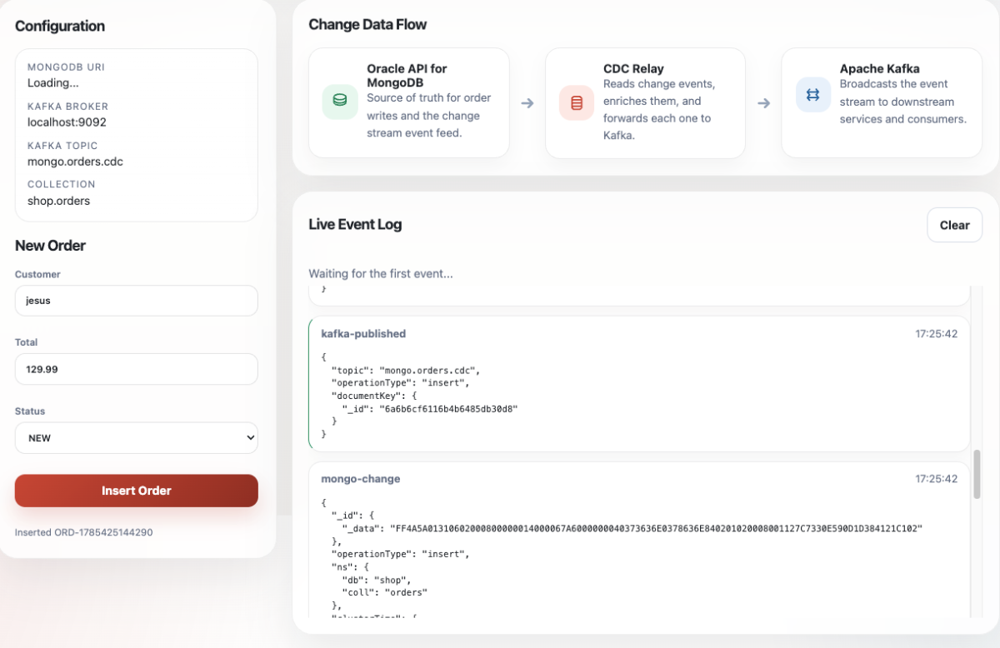

# Oracle API for MongoDB Change Streams to Kafka

```text
Oracle Autonomous AI JSON
        │
        ▼
Oracle API for MongoDB $changeStream
        │
        ▼
Node.js CDC Producer
        │
        ▼
Apache Kafka Topic
        │
        ├── Inventory
        ├── Analytics
        ├── Email
        └── Audit
```

This repository contains two applications:

- **mongo-kafka-cdc-cl** – Command-line CDC  (`cdc-mongodb-to-kafka.js`)
- **mongo-kafka-cdc-ui** – Browser-based CDC  with live event timeline

## Architecture

The repo illustrates a typical Change Data Capture (CDC) pattern:

1. An order is inserted into Autonomous AI JSON.
2. Oracle API for MongoDB $changeStream detect the change.
3. A Node.js application publishes the event to Kafka.
4. Kafka distributes the event to downstream consumers.

## Prerequisites

| Component | Version | Download |
|-----------|---------|----------|
| Node.js | 20 or newer | https://nodejs.org/download |
| npm | Included with Node.js | https://nodejs.org/download |
| Java JDK | 17 or newer | https://www.oracle.com/java/technologies/downloads/ |
| Apache Kafka | 4.3.x or newer | https://kafka.apache.org/downloads |
| Oracle AI Database JSON or Oracle Database 26ai + ORDS | Supported | https://www.oracle.com/database/ai-database/ |

Install the command-line dependencies:

```bash
cd mongo-kafka-cdc-cl
npm install mongodb kafkajs
```

Install the browser app dependencies:

```bash
cd ../mongo-kafka-cdc-ui
cp .env.example .env
npm install
```

Default configuration:

```text
MONGODB_URI=<your Oracle API for MongoDB URI>
MONGO_DB=shop
MONGO_COLLECTION=orders
KAFKA_BROKERS=localhost:9092
KAFKA_TOPIC=mongo.orders.cdc
```


## Create Oracle User

Connect to the database as **ADMIN** and execute the following script to create the demo schema and enable Oracle REST Data Services (ORDS):

```sql
DROP USER IF EXISTS shop CASCADE;

CREATE USER shop IDENTIFIED BY "DB23ee###12345";

ALTER USER shop QUOTA UNLIMITED ON DATA;

GRANT CONNECT, RESOURCE, SODA_APP, DB_DEVELOPER_ROLE TO shop;
GRANT CREATE NOTIFICATION DIRECTIVE TO shop;

BEGIN
  ords_admin.enable_schema(
    p_enabled => TRUE,
    p_schema  => 'SHOP'
  );
  COMMIT;
END;
/
```

## Set up Kafka

Download Kafka:

https://kafka.apache.org/downloads

```bash
export KAFKA_HOME=<path>/kafka_2.13-4.3.1
export PATH="$KAFKA_HOME/bin:$PATH"
cd $KAFKA_HOME
```

macOS:

```bash
export JAVA_HOME=$(/usr/libexec/java_home -v 17)
export PATH="$JAVA_HOME/bin:$PATH"
```

Format the storage (first time only):

```bash
KAFKA_CLUSTER_ID="$(bin/kafka-storage.sh random-uuid)"
bin/kafka-storage.sh format --standalone   -t "$KAFKA_CLUSTER_ID"   -c config/server.properties
```

Start Kafka:

```bash
bin/kafka-server-start.sh -daemon config/server.properties
```

Monitor the broker log:

```bash
tail -f $KAFKA_HOME/logs/server.log
```

Create the topic:

```bash
bin/kafka-topics.sh --bootstrap-server localhost:9092   --create --topic mongo.orders.cdc
```

## Command-line  

Open three terminals:

**T1**

```bash
bin/kafka-server-start.sh -daemon config/server.properties
```

**T2**

```bash
bin/kafka-console-consumer.sh   --bootstrap-server localhost:9092   --topic mongo.orders.cdc   --from-beginning
```

**T3**

```bash
cd mongo-kafka-cdc-cl
node cdc-mongodb-to-kafka.js "<Oracle API for MongoDB URI>"
```

## Browser  

```bash
cd mongo-kafka-cdc-ui
npm start
```

Open:

```text
http://localhost:3000
```

The UI displays:

 
